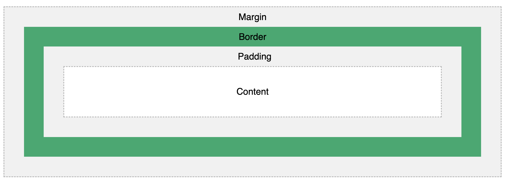

## CSS Box Model

The CSS Box Model is a core concept in web design, describing how elements are sized and spaced on a webpage. Each element consists of a content area surrounded by padding, borders, and margins.

The Box Model defines the space taken by each element, broken down into four areas:

1. **Content**: The main area where text, images, or other elements are displayed.
2. **Padding**: The space between the content and the border, providing internal spacing.
3. **Border**: A line surrounding the padding and content, offering a visual edge.
4. **Margin**: The outermost layer, creating space between the element and neighboring elements.

### Visualization of the CSS Box Model

Below is an illustration of the CSS Box Model, showing the relationships between content, padding, border, and margin:

---

## Backgrounds

The `background` property is used to control the visual appearance behind an element’s content and padding.

### Background Color

The `background-color` property sets the background color of an element.

**Example:**

    div {
        background-color: #f0f0f0;
    }

### Background Image

The `background-image` property sets an image as the background of an element.

**Example:**

    div {
        background-image: url('background.jpg');
    }

### Background Repeat and Position

- **`background-repeat`**: Determines whether a background image repeats.
    - Values: `repeat`, `no-repeat`, `repeat-x`, `repeat-y`

- **`background-position`**: Sets the starting position of the background image.
    - Values: `top`, `center`, `bottom`, `left`, `right`

**Example:**

    div {
        background-image: url('background.jpg');
        background-repeat: no-repeat;
        background-position: center;
    }

---

## Borders

The `border` property controls the lines surrounding an element's content and padding.

### Border Style, Width, and Color

- **`border-style`**: Sets the style of the border (e.g., solid, dotted).
- **`border-width`**: Determines the thickness of the border.
- **`border-color`**: Sets the color of the border.

**Example:**

    div {
        border: 2px solid #000;
    }

### Border Radius

The `border-radius` property allows you to round the corners of an element.

**Example:**

    div {
        border-radius: 10px;
    }

---

## Margin

The `margin` property controls the space outside an element, creating space between it and adjacent elements.

### Margin Values

You can specify margins individually or use shorthand:

- **Individual**: `margin-top`, `margin-right`, `margin-bottom`, `margin-left`
- **Shorthand**: `margin: 10px 20px 10px 20px;` (top, right, bottom, left)

**Example:**

    div {
        margin: 10px;
    }

---

## Padding

The `padding` property adds space between the content and the border, effectively increasing the element's internal space.

### Padding Values

You can specify padding individually or use shorthand:

- **Individual**: `padding-top`, `padding-right`, `padding-bottom`, `padding-left`
- **Shorthand**: `padding: 10px 20px 10px 20px;` (top, right, bottom, left)

**Example:**

    div {
        padding: 10px;
    }

